# JoinMember

# 📌 회원가입 구현

# 🚀 index 페이지
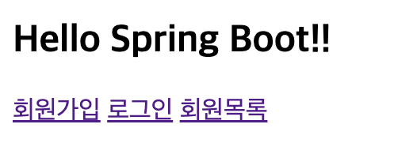

# 1️⃣ 회원가입 기능
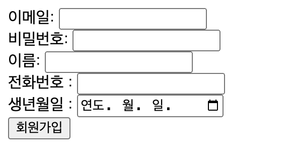

- 이메일 : String | @example
- 비밀번호 : String
- 이름 : String | 홍길동
- 전화번호 : String | 010-1234-5678
- 생년월일 : String | YYYY-MM--DD

### 2️⃣ 로그인 기능

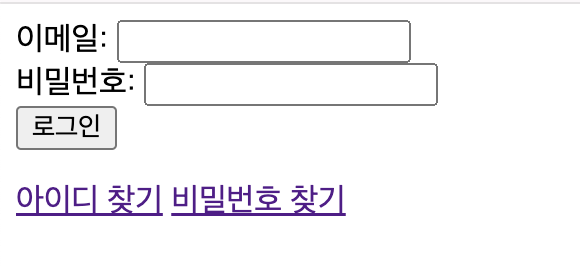

## ✅로그인 성공시 
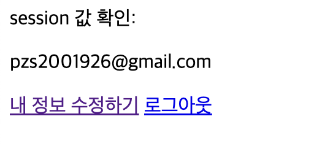
1. session 값을 저장
2. 내 정보 update 기능
3. 로그 아웃 기능

## ❌로그인 실패시

### 🔍 이메일이 틀렸을 때,
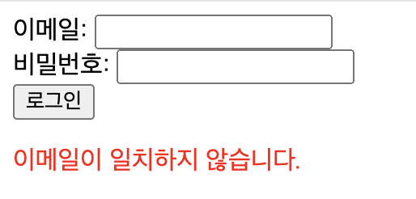
### 🔍 비밀번호만 틀렸을 때,
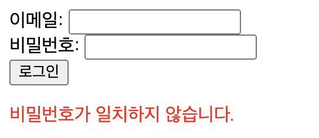

# 3️⃣ 회원 목록 기능
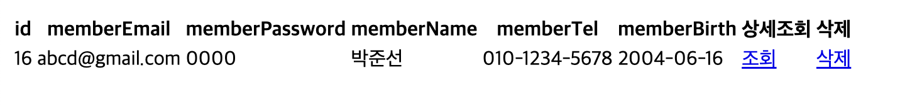

### 👉 상세조회
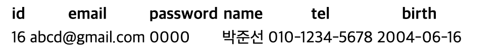

### 👉 삭제 기능 구현

# 4️⃣ 아이디/비밀번호 찾기

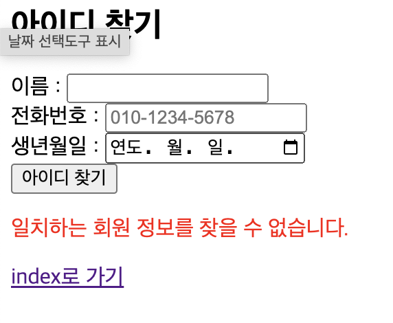

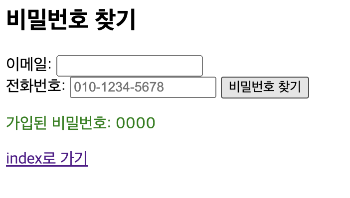

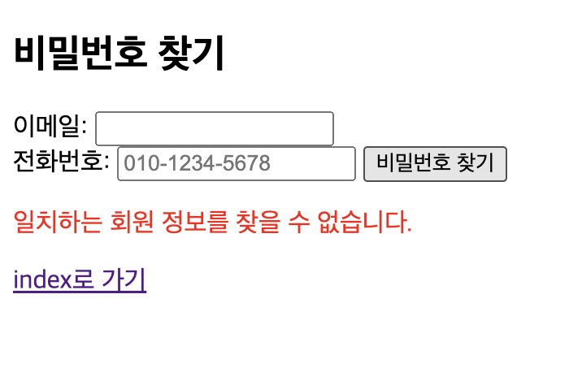